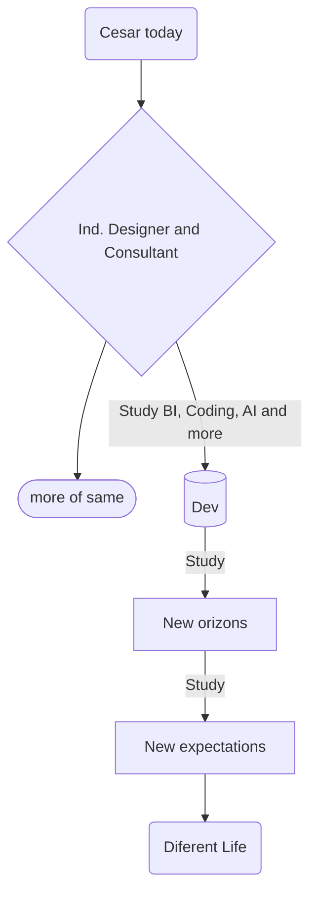

# Its_me Cesar R. Almeida

### About me

### About `Callmeida`

* Hi, my name is Cesar, i'm a industrial product designer.  
* i never write a single line of code but, I'm decide to change my career.
* Open for and in need to learn to grow personally and professionally.
* Really in searching for new opportunities. (see at my chart bellow)

### My career as a flow chart:

### My GitHub Stats

### Habilidades

 "Intro"
 "Básico"
 "Aprendendo"

## Aplicação de IA's para reduzir tempo de trabalho.

## 📒 Descrição
- Nestes projetos tive quero apresentar algumas possibilidades a partir do uso de ferramentas que utilizam a tecnologia de treinamento de maquina LLM, e redes adversárias.
Apliquei conceitos de estrutura na escrita de script. Mesmo usando linguagem natural afim de testar as capacidades de interprepação por parte das plataformas, poderá ver que os resultados obtidos são relativamente satisfatórios.

## 🏗️ Projetos

	
### 🤖 <b>Tecnologias Utilizadas nos projetos.</b>

 - ##### Avatar animado.

    - Geração de imagem por script - via Copilot. (https://copilot.microsoft.com/).

   - Geração de voz via texto TTS (text-to-speech) - TTSopenAI (https://ttsopenai.com/).

   - Geração de animação de avatar unindo imagem e audio - D-ID (www.d-id.com/)

 - ##### Restauração e edição de Fotografia.

    -Geração e edição de imagem por script. - Vizcom (https://app.vizcom.ai).

  - processo de animação - Luma labs (https://lumalabs.ai/dream-machine)

  

		
### 🔥<b> Processo de Criação e Resultados </b>

  - 

    
<b>Criação de avatar animado</b>

    #### Produto resultado de aplicação de varias instancias de IA.
    
    #### 1º - Geração de imagem por script - via Copilot. (https://copilot.microsoft.com/)
    ##### Prompt criado para imagem:
    - "Create a 3D realistic illustration of an animated programmer character, fit body, white Brazilian, voluminous black hair, small beard. casually seated on a social media block with the "LinkedIn" logo. The character is in their 30s, wearing rectangular black prescription glasses, and must wear casual modern clothing such as a basic, super white t-shirt, skater shoes, and brown pants. The background of the image is a social media profile page with the username "Cesar" and a profile picture that        matches the animated character."

      

    #### 2º - Geração de voz via texto TTS (text-to-speech) - TTSopenAI (https://ttsopenai.com/)
    ##### Texto base:
    - "Usei o copilot, para criar um avatar com características minimamente próximas ao objetivo que sou eu no caso. Já digo que quanto mais assertivo o resultado esperado, maior será o numero de informações que deve entregar. quanto menor o numero de dados para a IA, mais "criativa" por conta da IA será. O uso de linguagem natural é bem aceitado pelas plataformas, Dê preferencia a lingua inglesa, por conta da maior quantidade de conteudo usado para o treinamento das IA. Podemos usar nosso idioma, muitas plataformas fazer a tradução para o idioma de sua base mas aí podem acontecer os erros de contexto e alterar o resultado."

    #### 3º - Geração de animação de avatar unindo imagem e audio - D-ID (www.d-id.com/)
    
    - É uma API, que já a saída definida, Sem detalhamento por prompt, sendo necessario somente carregar os arquivos que serão utilizados para compor o video.

    #### Resultado

	[Clique aqui para assistir ao vídeo](https://www.youtube.com/embed/aGRNlgJqeDc)

  - 

    
<b>Restauração e criação de animação em fotografia</b>

    
    #### 1º - Edição da imagem por script - via Vizcom. (https://app.vizcom.ai)
    ##### Prompt criado para imagem:
    - "Photo realistic 8k like photo, white background, beauty girl with realistic 8k blond hair, chuby face, perfect skin, light pink lips and 8k grey realistic eyes, full hd texture full arm cover green dress."
  	##### imagem base:
    
		
	##### Resultado

	  
    
    #### 2º - Animação da imagem - Luma labs (https://lumalabs.ai/dream-machine)
    "A api ainda em desenvolvimento necessita de um prompt muito robusto para que o resultado seja o mais conforme possivel. utilizei dois resultados do mesmo prompt unidos para obter o video final.
    ##### Prompt base:
    "start as colorfull, she place the camera at stand, positioning herself, than a flash lights, and finish with the old photo as a final result."

	[Clique aqui para assistir ao vídeo](https://youtube.com/shorts/KTOhz-om5ME)
 
   

## 💭 Reflexão
"Hoje, para extrair o potencial das IA's, um script bem estruturado e a validação de fontes se fazem necessarios e demonstram a importância do conhecimento basico para garantir a eficácia da IA. A combinação de conhecimento humano e inteligência artificial é fundamental para obter resultados precisos e códigos eficientes. Estamos vivendo a evolução ao ponto de cada vez mais, termos resultados satisfatórios apenas com uso de linguagem natural"

#### Sobre mim:

  Meus contatos: professional e mídia

  
- [ ] 

- [ ] 

- [ ] 

  💻 Meu setup  
  
  
  
  
